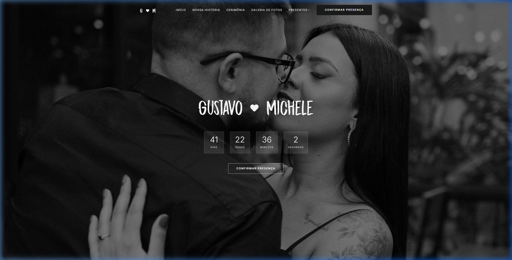

# Gustavo & Michele - Casamento 06.06.2026

Site oficial do casamento de Gustavo e Michele, desenvolvido para facilitar a comunicação com os convidados, gerenciar confirmações de presença (RSVP) e compartilhar informações importantes sobre o grande dia.



## 🚀 Tecnologias

Este projeto foi construído com tecnologias modernas para garantir uma experiência premium e responsiva:

- **React** + **Vite**
- **Lucide React** (Ícones)
- **CSS3** (Design personalizado e responsivo)
- **Supabase** (Banco de dados e autenticação)
- **Vercel** (Deploy)

## ✨ Funcionalidades

- **Contagem Regressiva**: Acompanhamento em tempo real para o grande dia.
- **Nossa História**: Seção dedicada à jornada do casal.
- **Cerimônia e Recepção**: Informações detalhadas sobre local, horário e traje.
- **Galeria de Fotos**: Espaço para compartilhar momentos especiais.
- **Lista de Presentes**: Integração com mimos e contribuições via PIX.
- **RSVP (Confirmação de Presença)**: Sistema de confirmação integrado ao banco de dados.

## 📍 Localização

O evento será realizado no **Max Belém** (Salão de Festas do Condomínio).
Endereço: R. Elói Cerqueira, 287 - Belém, São Paulo - SP.

## 🛠️ Instalação e Uso

Para rodar o projeto localmente:

1. Clone o repositório:
   ```bash
   git clone https://github.com/guuhferiani/casamento.git
   ```

2. Instale as dependências:
   ```bash
   npm install
   ```

3. Inicie o servidor de desenvolvimento:
   ```bash
   npm run dev
   ```

---

Desenvolvido com ❤️ para um dia inesquecível.
